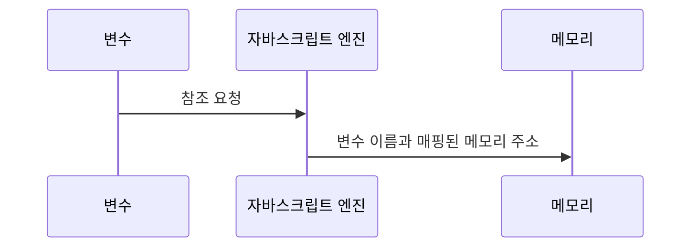

# 04 변수

## 4.1 무엇이고, 왜 필요한가

`프로그래밍 언어에서 데이터를 관리하기 위한 핵심 개념`

- 하나의 값을 저장하기 위해 확보한 메모리 공간 자체
- 메모리 공간을 식별하기 위해 붙인 이름

#### 10 + 20 어떻게 계산할 것인가?

> 10, 20 (리터럴)
> +(연산자)
> 10 + 20 (표현식)
> 표현식이라는 것 (파싱) 할 수 있어야한다.

**연산 전**

> js엔진은 좌,우변 숫자 값 (피연산자)를 기억한다

    const result = 10 + 20

- 30은 메모리에 저장이된다.
- 30을 다시 가지고 와서 재사용을 위해 메모리 공간에 이름을 붙인 것

변수에 값을 저장하는 것 `할당`
변수에 저장된 값을 읽어 들이는 것 `참조`



**이렇게 저장된 값을 반환한다.**

## 4.2 식별자

### 1) 변수의 이름 ? "식별자"

`식별자는 어떤 값을 구별해서 식별할 수 있는 고유한 이름`

### 2) 식별자로 값을 구별해서 식별한다?

식별자는 값이 아니라 메모리 주소를 기억하고 있다.

`식별자가 기억하고 있는 메모리 주소를 통해 
메모리 공간에 저장된 값에 접근 할 수 있다는 의미 `

### 3) 식별자는 변수만 해당하는가?

아니다. 변수, 함수, 클래스 등의 이름은 모두 식별자다.

### 4) 식별자의 존재는 어떻게 알리는가?

선언에 의해 자바스크립트 엔진에 식별자 존재를 알린다.

## 4.3 변수 선언

### 1) 그게 무엇인가

`변수를 생성하는 것`

> `변수 선언(Variable Declaration)` 은 값을 저장하기 위한 `메모리 공간을 확보`하고 `변수 이름과 확보된 메모리 공간의 주소를 연결`해서 값을 저장할 수 있게 `준비하는 과정`

- 변수 선언 시 사용하는 키워드 : var, let, const
- 과거에는 var 뿐 이었다.

> var 단점 : 블록 레벨 스코프 지원 x, 함수 레벨 스코프 지원 o
> => 이로 인해 의도치 않게 전역 변수가 선언되어 부작용 발생

### 2) let, const은 왜 생겨났나

> var 단점을 보완하기 위해서이다. 이 둘은 블록 레벨 스코프를 지원한다.

### 3) 변수 선언문

    var score;

변수 선언한 이후 아직 변수에 값을 할당하지 않았다.

#### 그럼 확보된 메모리 공간은 비어있는 가?

`아니다` 자바스크립트 엔진에 의해 undefined라는 값이 암묵적으로 할당되어 초기화된다. 이것은 자바스크립트의 독특한 특징이다.

#### 어떻게 선언하냐

- 선언단계 : 이름을 등록해서 자바스크립트 엔진에 변수 존재알림
- 초기화 단계 : 값 저장을 위한 메모리 공간 확보, 암묵적으로 undefined 할당 후 초기화

### 4) 변수 초기화

`일반적으로 초기화란 변수가 선언된 이후 최초로 값을 할당하는 것`

## 4.4 변수 선언의 실행 시점과 호이스팅

```
// 변수 선언문보다 변수를 참조하는 코드가 앞에 있는 경우
console.log(person); // undefined
var person; // 변수 선언문
```

=> 당연히 `ReferenceError`가 날 것이라 생각했다.

js는 인터프리터에 의해서 한 줄씩 순차적으로 실행되기에 왜냐 변수를 선언이 되지않았으니까 당연히 그럴거라고 생각했다..

하지만, **undefined**가 출력이 된다.

### 1) 왜?

> 변수 선언이 소스 코드가 한 불씩 순차적으로 실행되는 시점,
> 즉 런타임이 아니라 그 이전 단계에서 먼저 실행이 되기 때문이다.

### 2) 왜? 먼저?

> 소스 코드가 한 줄씩 순차적으로 실행하기에 앞서 먼저 **소스코드 평가 과정**을 거친다. 그 과정에서 **변수 선언을 포함한 모든 선언문**을 소스코드에서 찾아내 먼저 실행한다. 그리고 평가 과정이 끝나면 한 줄씩 순차적으로 실행한다.

그래서 변수 선언이 어디에 있는 다른 코드보다 먼저 실행된다.

### 3) 왜? 평가 과정을:question::question:

> 이것음 변수 선언문이 코드의 선두로 끌어 올려진 것처럼 동작하는 자바스크립트 고유의 특징으로 `변수 호이스팅` 이라 한다.

변수 선언 뿐만아니라 변수, 함수, 클래스 등 호이스팅 된다. 모든 선언문은 런타임 이전 단계에서 먼저 실행되기 때문이다.

## 4.5 값의 할당

### 1) 변수 선언과 값의 할당 실행 시점은 다르다!

- 변수 선언 : `런타임 이전에 먼저 실행`
- 값의 할당 : `런타임에 실행`

```
console.log(score); // undefined

var score; // 1. 변수 선언
score=80; // 2. 값의 할당

console.log(score) // 80
```

### 2) 그럼 이 녀석의 값은?

**80**

```
console.log(score); // undefined

score=80;
var score;

console.log(score)
```

### 3) 왜:question::question:

값을 다시 할당 해줬으니까.

## 4.6 값의 재할당

위와 같은 경우를 **재할당**이라고 한다

### 1) 만약 변수를 변경할 수 없다면

그것은 **변수**가 아닌 **상수**이다.

### 2) 한번만 할당할 수 있는 키워드가 있는가

`YES` 그것은 **const** 이다. **const**는 **상수를** 표현할 수 있다.
하지만 const는 상수만을 위해 사용하지는 않는다.

### 3) 재할당하면 메모리 공간에서 삭제 되는가

`NO` 새로운 메모리 공간을 확보하고 그 메모리 공간에 값을 저장합니다.
남아 있는 불필요한 값들은 **가비지 콜렉터**에 의해 메모리에서 자동 해제 됩니다.

### 4) 가비지 콜렉터?

앱이 할당한 메모리 공간을 주기적으로 검사하여 더 이상 사용되지 않는 메모리를 해제하는 기능

## 4.7 식별자 네이밍 규칙

- 식별자는 특수문자를 제외한 `문자, 숫자, 언더스코어(_), 달러 기호($)` 를 포함 할 수 있다.
- 단, 식별자는 특수문자를 제외한 `문자, 언더스코어(_), 달러 기호($)` 로 시작해야 한다. (`숫자 시작 X`)
- [예약어](http://www.w3bai.com/ko/js/js_reserved.html)는 식별자로 사용할 수 없다.
